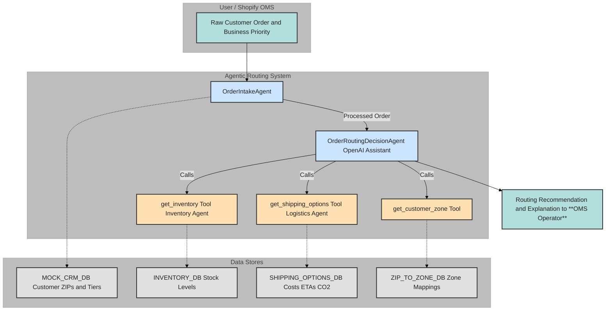

# Agentic AI Order Routing POC for Commerce Operating System

## 1. Overview & Purpose

This project demonstrates a Proof of Concept (POC) for an AI-driven, agentic order routing system. It simulates how multiple AI agents can collaborate to make intelligent fulfillment decisions within the context of a modern Commerce Operating System. The primary goal is to showcase how an agentic approach offers superior flexibility, explainability, and scalability compared to traditional hard-coded IF-THEN-ELSE rule-based systems.

This POC specifically focuses on routing an order from a simplified Shopify-like Order Management System (OMS) by considering factors like inventory availability, shipping logistics (cost, time, CO2 impact), and dynamic business priorities.

## 2. Relation to a Commerce Operating System

In a comprehensive Commerce Operating System (COS), order routing is a critical function that intelligently connects customer orders with fulfillment capabilities. An agentic approach, as demonstrated here, allows this function to be:
* **Adaptive:** Responding to real-time changes in inventory, carrier performance, or business strategy.
* **Integrated:** Seamlessly pulling data from various sources (Inventory, Logistics, CRM) through specialized agents or services.
* **Optimized:** Striving for multi-objective optimization (e.g., balancing cost, speed, sustainability, customer experience) rather than single-factor decisions.
* **Automated:** Reducing manual intervention for routine decisions while providing clear insights for exceptions.

This POC exemplifies the "intelligent execution" layer of a COS for the order fulfillment lifecycle.

## 3. Key Features & What it Demonstrates

* **Multi-Agent Simulation:** Illustrates distinct agent roles and responsibilities:
    * `OrderIntakeAgent`: Processes and enriches incoming orders.
    * `InventoryQueryAgent` (via Tool): Provides stock availability.
    * `LogisticsOptionsAgent` (via Tool): Provides shipping options, costs, ETAs, and CO2 data.
    * `OrderRoutingDecisionAgent` (Core OpenAI Assistant): Orchestrates, evaluates, decides, and explains to Supply Chain Operator.
* **Dynamic Decision-Making:** Shows how routing decisions change based on configurable `business_priority` inputs (e.g., "MINIMIZE_COST", "MINIMIZE_DELIVERY_TIME", "PRIORITIZE_GOLD_TIER_SPEED", "MINIMIZE_CO2").
* **Explainability:** The `OrderRoutingDecisionAgent` provides natural language justifications for its routing choices.
* **Flexibility:** Highlights the ease of adapting to new priorities or (conceptually) new data sources without rewriting a complex rules engine.
* **Modularity:** The use of tools for specific data gathering (inventory, logistics) showcases how different components of the system can be independently managed and updated.

* **Agent Cooperation Diagram (POC)**



## 4. Conceptual Agent Roles

* **`OrderIntakeAgent` (Simulated Python function):**
    * Validates and enriches raw order data (e.g., fetching customer ZIP from a mock CRM).
* **`InventoryQueryAgentTool` (Python function callable by Assistant):**
    * Represents the interface to an inventory system, providing stock levels for products across various fulfillment locations.
* **`LogisticsOptionsAgentTool` (Python function callable by Assistant):**
    * Represents the interface to a logistics system, providing shipping options, costs, ETAs, and CO2 impact estimates.
* **`CustomerZoneServiceTool` (Python function callable by Assistant):**
    * A utility service to map customer ZIP codes to predefined shipping zones.
* **`OrderRoutingDecisionAgent` (OpenAI Assistant - `gpt-4o` or `gpt-3.5-turbo`):**
    * The core intelligence. It receives the processed order and business priorities.
    * Orchestrates calls to the other tools/services to gather necessary information.
    * Evaluates options based on the given priority.
    * Generates a recommended route with a clear explanation and viable alternatives.

## 5. Technology Stack

* **Python 3.8+**
* **OpenAI Python SDK:** For interacting with the Assistants API.
* **OpenAI API or Gemini API:** Requires an API key with access to GPT models

## 6. Setup Instructions

1. **Clone the repository:**
    ```bash
    git clone <repository_url>
    cd <repository_name>
    ```

2. **Create and activate a virtual environment (recommended):**
    ```bash
    # Create virtual environment
    python -m venv .venv
    
    # Activate virtual environment
    # On macOS/Linux:
    source .venv/bin/activate
    # On Windows:
    .venv\Scripts\activate
    ```

3. **Install the package in development mode:**
    ```bash
    # Install the package and its dependencies
    pip install -e .
    ```

4. **Set up your API keys:**
    * Create a `.env` file in the root of the project
    * Add your API keys to the `.env` file:
      ```
      OPENAI_API_KEY=your_openai_api_key_here
      GEMINI_API_KEY=your_gemini_api_key_here
      ```

## 7. Running the POC

You can run the POC in two ways:

### Option 1: Using the run script (Recommended)
```bash
./run.sh
```
This script will:
1. Create and activate a virtual environment if needed
2. Install the package in development mode
3. Check for required environment variables
4. Run the main application

### Option 2: Manual execution
```bash
# Activate virtual environment
source .venv/bin/activate  # On Windows: .venv\Scripts\activate

# Install package
pip install -e .

# Run the script from the src directory
cd src
python -m agentic_order_routing.main
```

The script will:
1. Process a sample order through the intake agent
2. Route the order based on the specified business priority
3. Display the final routing recommendation with explanation

You can view the trace of the agent interactions at the URL printed in the console.

## 8. Development

To modify or extend the POC:
1. The agent tools are in the `tools/` directory
2. Mock data is in `mock_data.py`
3. Main orchestration is in `main.py`
