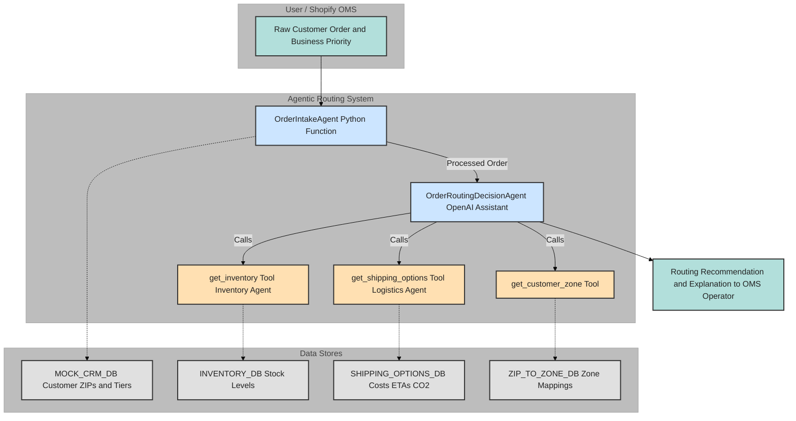

# Mermaid Debug

```mermaid
%%{init: {"theme": "base", "themeVariables": { "primaryColor": "#f4f4f4", "primaryTextColor": "#222", "secondaryColor": "#e0e0e0", "tertiaryColor": "#bdbdbd", "fontSize": "16px" }}}%%
graph TD
    subgraph "User / Shopify OMS"
        A[Raw Customer Order and Business Priority]
    end

    subgraph "Data Stores"
        DB1[MOCK_CRM_DB Customer ZIPs and Tiers]
        DB2[INVENTORY_DB Stock Levels]
        DB3[SHIPPING_OPTIONS_DB Costs ETAs CO2]
        DB4[ZIP_TO_ZONE_DB Zone Mappings]
    end

    subgraph "Agentic Routing System"
        OIA[OrderIntakeAgent Python Function]
        ORDA[OrderRoutingDecisionAgent OpenAI Assistant]

        tool_cz[get_customer_zone Tool]
        tool_inv[get_inventory Tool Inventory Agent]
        tool_so[get_shipping_options Tool Logistics Agent]
    end

    A --> OIA
    OIA -->|Processed Order| ORDA
    OIA -.-> DB1

    ORDA -- Calls --> tool_cz
    tool_cz -.-> DB4

    ORDA -- Calls --> tool_inv
    tool_inv -.-> DB2

    ORDA -- Calls --> tool_so
    tool_so -.-> DB3

    ORDA --> Z[Routing Recommendation and Explanation to OMS Operator]

    %% Custom styles for readability
    classDef default fill:#f4f4f4,stroke:#333,stroke-width:2px,color:#222,font-size:16px;
    classDef agent fill:#cce5ff,stroke:#333,stroke-width:2px,color:#222;
    classDef tool fill:#ffe0b2,stroke:#333,stroke-width:2px,color:#222;
    classDef data fill:#e0e0e0,stroke:#333,stroke-width:2px,color:#222;
    classDef io fill:#b2dfdb,stroke:#333,stroke-width:2px,color:#222;

    class OIA,ORDA agent;
    class tool_cz,tool_inv,tool_so tool;
    class DB1,DB2,DB3,DB4 data;
    class A,Z io;
```